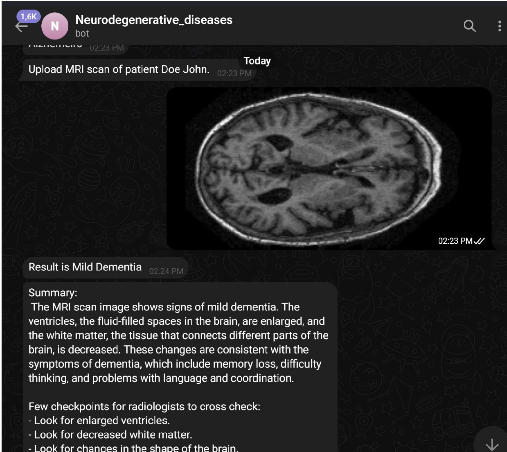
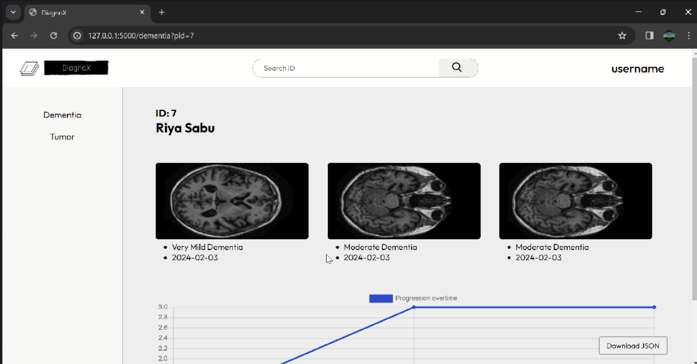

# Diagnox

## Features 
- Telegram Bot, easy interface for doctors 
    - a short description is given to an uploaded MRI/CT scan
    - This will include high interest areas,
     signs of disease, segmentation of abnormalities and more.
- Doctors can use as a reference, cross check, manage scan data to make their process faster, easier & smoother.  

## Demo 

### Bot interface 

### Web interface 

## About Us 

Developed as a part of ScaleUp Hackathon 24' . 

Team Rex : 
1. [Arjun A I](https://github.com/Arjun-A-I)
2. [Aslam Naseer](https://github.com/Aslam-Naseer)
3. Jeevan 
4. [Riya Sabu](https://github.com/riya461)